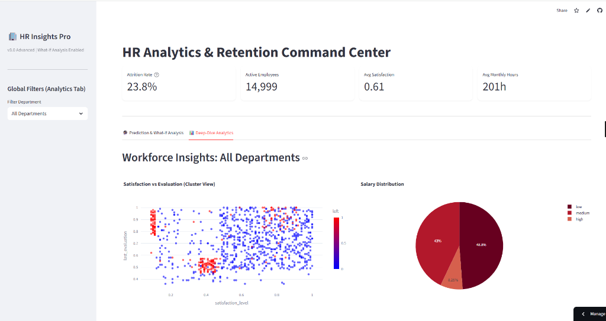
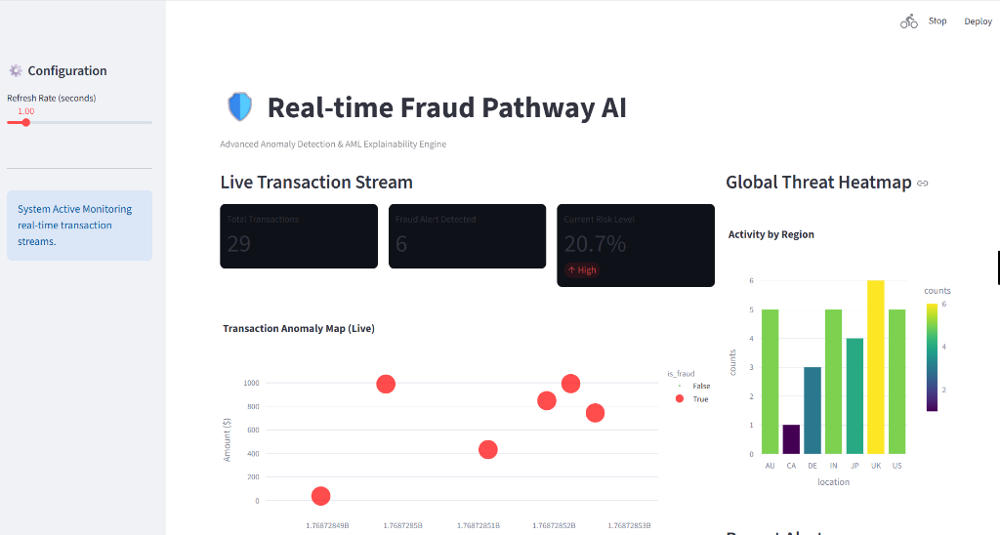
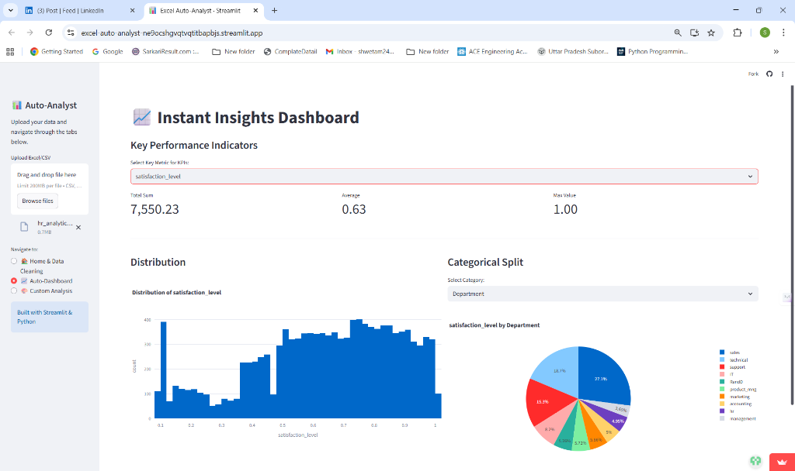
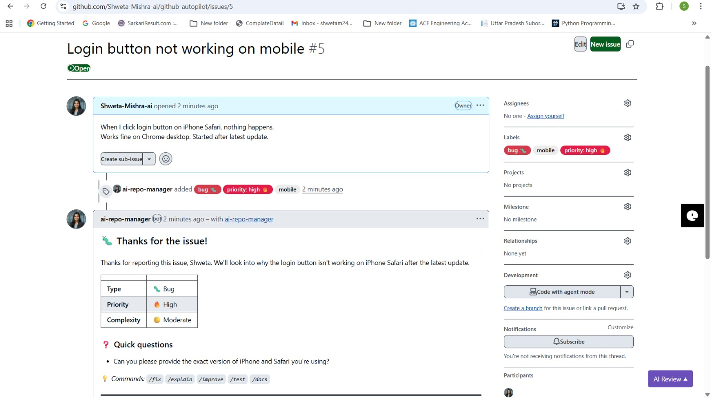

  

 

  

  <strong>⚡ AI Systems • Data Intelligence • Real-World Impact</strong>

  <em>Turning Data → Intelligence → Automation</em>

---

> "Bridging AI research and production systems — from notebooks to scalable, real-world impact."

---

### 👩‍💻 About Me

**AI Engineer | Data Scientist | Python Developer**  
Founder @ **TechNova World**  

🌍 Open to **Remote / India / Global opportunities**  

🎯 **Actively seeking 2026 roles & freelance projects**

- Full-time: AI Engineer | Data Scientist | Data Analyst | MLOps  
- Freelance: Data dashboards | AI tools | Automation systems | Streamlit apps | Power BI | GitHub bots  

---

## 🛠️ Tech Stack

  

 

  <table>
    <tr>
      <th>Core AI/ML</th>
      <th>MLOps & Production</th>
      <th>Data & Visualization</th>
      <th>Application Layer</th>
    </tr>
    <tr>
      <td>Python, PyTorch, TensorFlow, Scikit-learn, XGBoost, LangChain</td>
      <td>FastAPI, Docker, PostgreSQL, CI/CD, GitHub Actions</td>
      <td>Pandas, NumPy, Plotly, Power BI, Tableau</td>
      <td>Streamlit, React, Tailwind CSS</td>
    </tr>
  </table>

---

## 🚀 Featured Work

### 🧠 HR Intelligence System v3.0
Attrition prediction + what-if simulation engine  
→ Real-time workforce risk insights  

---

### 🛡️ Real-Time Fraud Graph AI
Graph-based fraud detection system  
→ Live transaction monitoring & anomaly detection  

---

### 📊 Excel Auto-Analyst
Instant analytics engine for CSV/Excel  
→ Auto KPI detection + interactive dashboards  

---

### 🤖 GitHub Autopilot
LLM-powered repo automation system  
→ PR analysis | Issue triage | Security insights  

---

## 📈 Engineering Activity

  
  

    

  

 

  

 

---

## 🎓 Certifications

  
  
  

---
## 🏆 Certifications

  

## 💼 Work With Me

  

 

  

---

  ⭐ If you find my work valuable, consider starring my repositories.

