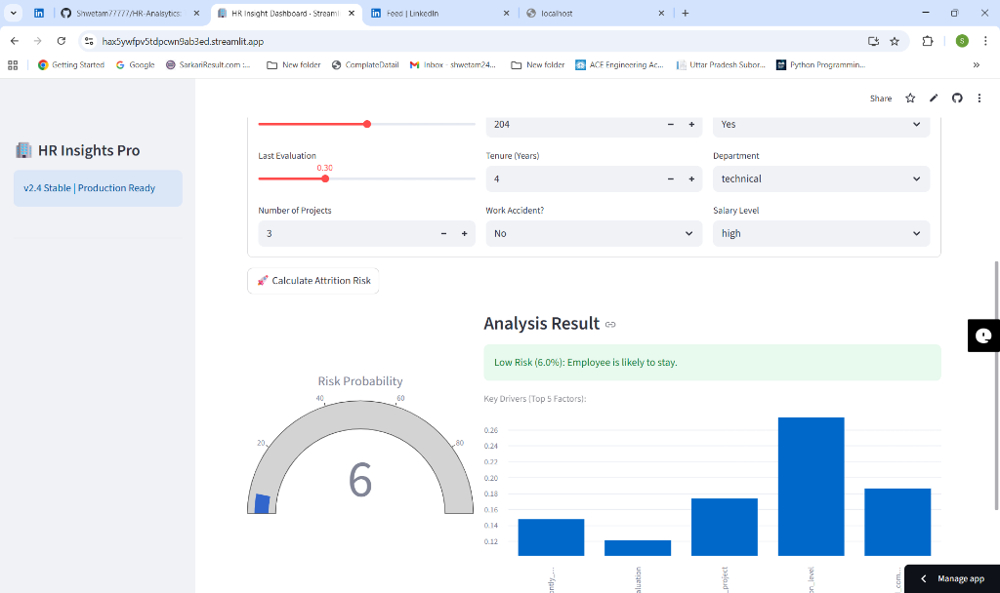
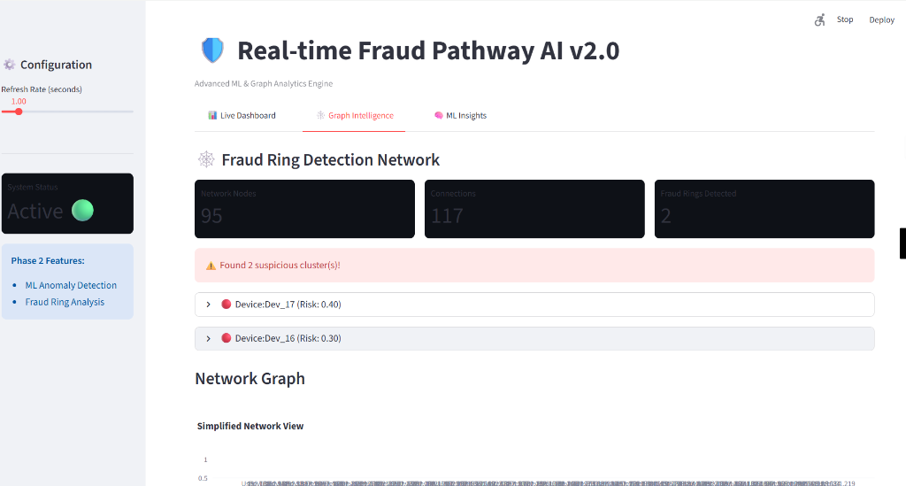

# Hello, I'm Shweta. 👋

### Founder @ TechNova World | AI Full Stack Engineer | Data Scientist

> *"I bridge the gap between AI Research and Production Engineering."*

I am the **Founder of TechNova World** and a passionate **AI Engineer** specializing in building intelligent, scalable systems. My focus is on moving AI out of notebooks and into real-time applications.

> 🎯 **Open For**: Full-Time AI Engineering Roles & Strategic Consulting.
> 🚀 **Building**: TechNova World (Future AI Startup).

---

## 🏗️ The AI Architecture Stack

| **Core AI** | **MLOps & Data** | **Full Stack UI** |
| :--- | :--- | :--- |
|    |    |    |

---

## 🚀 Featured Visual Portfolio

### 1. [HR Intelligence System v3.0](https://github.com/Shwetam77777/HR-Analytics) 🏢
**Prescriptive Analytics Platform**: Uses Random Forest to predict attrition and simulate retention strategies (salary hikes, promotions).
*   **Key Feature**: "What-If" Retention Simulator & Global Department Filtering.
*   **Metric**: Reduced inference latency by 90% via model serialization.

  
  

---

### 2. [Real-Time Fraud Graph AI](https://github.com/Shwetam77777/fraud-analysis) 🛡️
**Financial Security Engine**: Combines **Isolation Forest** (ML) with **Graph Theory** to detect fraud rings in real-time.
*   **Key Feature**: Live Transaction Stream & Global Threat Heatmap.
*   **Tech**: NetworkX for graph centrality analysis + Streamlit for real-time alerts.

  
  

---

### 3. [Excel Auto-Analyst](https://github.com/Shwetam77777/excel-auto-analyst) �
**Instant BI Tool**: Drop any Excel/CSV file and get an instant, interactive dashboard.
*   **Key Feature**: Automatic KPI detection and Distribution Analysis.
*   **Tech**: Pandas, Plotly, Streamlit.

  

---

### 4. [AI Multi-Agent Orchestrator](https://github.com/Shwetam77777/ai-multi-agent-mvp) 🤖
**Autonomous Systems**: A robust framework where specialized agents collaborate to solve complex workflows without human intervention.
*   **Architecture**: Custom Agent Protocol + LLM Integration.

---

## 📈 Engineering Velocity

I believe in **"Always Be Shipping"**. My GitHub activity reflects a commitment to daily code improvements and open-source contribution.

  
  

*(Notes: Stats include contributions to private repositories and commercial projects).*

---

### 💼 Work With Me
Whether you need a **Senior Engineer** to lead a team or a **Consultant** to validate a TechNova idea, I deliver results.

 
