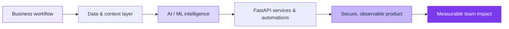

<div align="center">


<p>
  <a href="https://www.linkedin.com/in/shweta-mishra-ai"></a>
  <a href="https://github.com/Shweta-Mishra-ai?tab=repositories"></a>
  <a href="https://github.com/sponsors/Shweta-Mishra-ai"></a>
</p>


<p><strong>I design AI and data products that turn complex workflows into reliable, useful systems.</strong></p>
<p>LLM applications · AI automation · data intelligence · production APIs</p>

</div>

## About

I am an AI/ML Engineer and the founder of **TechNova World**. I build end-to-end AI systems—from data and model design to APIs, deployment, and business workflows.

My work sits at the intersection of **LLM context engineering, agentic automation, machine learning, and practical product delivery**. I care about systems that are measurable, maintainable, and valuable beyond a demo.

```text
Systems over scripts  ·  Deployment over notebooks  ·  Impact over experimentation
```

<div align="center">
  
  <a href="https://github.com/Shweta-Mishra-ai?tab=repositories"></a>
  
</div>

<div align="center">
  <sub>Explore the systems below — if one is useful, consider giving the repository a star.</sub>
</div>

## What I build



| Area | Focus |
| --- | --- |
| **LLM systems** | RAG, MCP, semantic caching, context management, multi-provider reliability |
| **Business automation** | n8n workflows, API integrations, approval flows, alerts, document and data operations |
| **Data science & ML** | EDA, feature engineering, predictive modelling, anomaly detection, decision intelligence |
| **Production engineering** | FastAPI, Docker, PostgreSQL, CI/CD, API architecture, reliable deployment |

## Selected work

### [TokenMizer](https://github.com/Shweta-Mishra-ai/tokenmizer) — Context infrastructure for AI agents

Graph-based session memory for preserving decisions, context, and history across LLM conversations. Built for efficient context use, with FastAPI and MCP-oriented developer workflows.

**Focus:** context engineering · semantic memory · FastAPI · MCP · LLM reliability

### [GitHub Autopilot](https://github.com/Shweta-Mishra-ai/github-autopilot) — AI-powered repository operations

A GitHub App for PR analysis, code review, issue triage, repository health monitoring, and automated developer workflows using a resilient multi-provider LLM strategy.

**Focus:** AI agents · developer tooling · GitHub automation · code intelligence

### [Real-Time Fraud Pathway](https://github.com/Shweta-Mishra-ai/realtime-fraud-pathway) — Streaming risk intelligence

Real-time fraud detection using live transaction streams, risk scoring, and LLM-assisted explanations grounded in AML and compliance knowledge.

**Focus:** streaming ML · anomaly detection · RAG · risk systems

### [Excel Auto-Analyst](https://github.com/Shweta-Mishra-ai/excel-auto-analyst) — Data-to-insight automation

An AI-assisted analytics tool that cleans Excel data, identifies KPIs, and turns raw files into interactive, decision-ready insights.

**Focus:** data intelligence · analytics automation · business intelligence · AI UX

> More open-source projects: [github.com/Shweta-Mishra-ai](https://github.com/Shweta-Mishra-ai?tab=repositories)

## Capabilities — AI engineering, data science & automation

<p align="center">
  
</p>

- **Data science:** exploratory data analysis, data cleaning, SQL analysis, feature engineering, model evaluation, statistical insight, dashboarding
- **Machine learning:** classification, regression, forecasting, anomaly detection, model explainability, PyTorch, TensorFlow, scikit-learn, XGBoost
- **AI systems:** LLM applications, RAG, context engineering, semantic memory, MCP, AI agents, evaluation and guardrails
- **Automation & integration:** n8n, webhooks, REST APIs, third-party integrations, scheduled workflows, notifications, human-in-the-loop approvals
- **Product & platform:** Python, FastAPI, Docker, PostgreSQL, GitHub Actions, React, Tailwind CSS, AWS and Azure

## Certifications & research

<p>
  <a href="https://www.coursera.org/account/accomplishments/specialization/G9PERGZMFBGP"></a>
  <a href="https://www.coursera.org/account/accomplishments/verify/MX2SYA8AFZLG"></a>
  <a href="https://www.coursera.org/account/accomplishments/verify/580QY6JC7G3Y"></a>
  <a href="https://www.credly.com/users/shweta-mishra.e8db4bbd"></a>
</p>

I also explore the engineering limits of LLM context windows and how systems can retain useful context without carrying unnecessary token cost.

## AI automation & MVP delivery

I collaborate with founders and teams building practical AI products, including:

- LLM-powered internal tools and workflow automation
- Business process automations with **n8n**, APIs, webhooks, and connected tools
- FastAPI backends, AI integrations, and production-ready MVPs
- Retrieval and knowledge systems for documents, support, and operations
- Data intelligence dashboards and decision-support systems
- GitHub automation, code-review workflows, and developer productivity tools

If you are building an AI product and need an engineer who can connect the model, the system, and the user experience, let’s talk.

<div align="center">
  <a href="https://www.linkedin.com/in/shweta-mishra-ai"></a>
</div>

## Open source, built for use

I build in public and keep my work accessible for developers and teams who want practical AI systems—not just demos. Explore the repositories, use what helps, and star the projects you value.

<div align="center">
  
</div>
